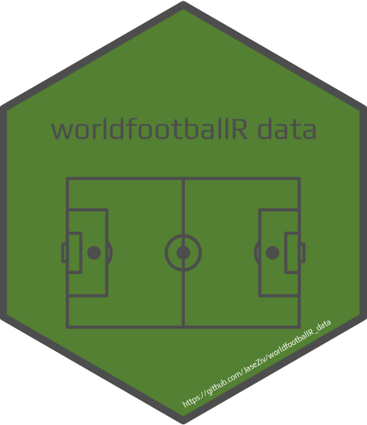

# worldfootballR_data 

<!-- badges: start -->

<!-- badges: end -->

# worldfootballR_data
Repository to hold various data sets scraped from the sites supported in the [`worldfootballR`](https://github.com/JaseZiv/worldfootballR) package. Current sites include:

* fbref.com
* transfermarkt.com
* understat.com
* fotmob.com

***

## The Data

The data can be split up into two main categories:

### 1. Supporting data to help with the functions in `worldfootballR`:

* [Fbref Comps and Leagues](https://github.com/JaseZiv/worldfootballR_data/raw/master/raw-data/all_leages_and_cups/all_competitions.csv)
* [Transfermarkt Leagues](https://github.com/JaseZiv/worldfootballR_data/raw/master/raw-data/transfermarkt_leagues/main_comp_seasons.csv)
* [Mapping between FBref and Transfermarkt Players](https://github.com/JaseZiv/worldfootballR_data/blob/master/raw-data/fbref-tm-player-mapping/output/fbref_to_tm_mapping.csv)

### 2. Data sets used in the `load_` functions in `worldfootballR`:

* [FBref Big 5 League Advanced season stats](https://github.com/JaseZiv/worldfootballR_data/tree/master/data/fb_big5_advanced_season_stats)

For players and teams, all advanced statistic data available on the site
  
* [FBref match results - Domestic Leagues](https://github.com/JaseZiv/worldfootballR_data/tree/master/data/match_results)

Includes match results played for all domestic leagues available on the site, for all years match results are listed under the fixtures section of leagues

* [FBref match results - International matches and domestic cups](https://github.com/JaseZiv/worldfootballR_data/tree/master/data/match_results_cups)

Includes match results played for all domestic cups and international matches available on the site, for all years match results are listed under the fixtures section of cups/comps

* [Understat shot locations for the Big 5 leagues](https://github.com/JaseZiv/worldfootballR_data/tree/master/data/understat_shots)

Shooting data and locations for the big 5 leagues since the 2014/15 seasons.

Shout out to [Mark Wilkins](https://twitter.com/biscuitchaser) for supplying the original data dump of the seasons for all big 5 leagues from 2014/15 to 2021/22. The data was originally [here](https://github.com/Markjwilkins/Understat)
